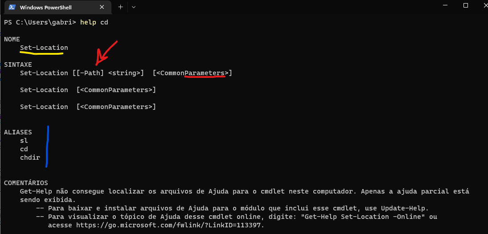

## Powershell Lv II

---

### Sumario

- [Oque esperar do powershell Lv 2?](#oque-esperar-do-powershell-lv-2?)
  - [Topico 1 Revisao Shell](#topico-1-revisao-shell)
    - [Regras de Ouro do Shell](#regras-de-ouro-do-shell)
    - [Comandos do Powershell](#comandos-do-powershell)
  - [Topico 2 Revisao Powershell Script](#topico-2-revisao-powershell-script)
    - [Scripts em Powershell](#scripts-em-powershell)
- [O Powershell Lv 2](#o-powershell-lv-2)

### Oque esperar do Powershell Lv 2?

----

Resumidamente, o powershell lv 2 um complemento dos seus conhecimentos com a linguagem do Powershell. Nesse nivel agora, voces ja sabem o basico necessario para desenvolver solucoes melhores utilizando essa ferramenta.
A ideia do powershell lv 2 é justamente utilizar essa ferramenta para elaborar soluções *"da vida real"* dividida em alguns tópicos detalhadamente selecionados para facilitar principalmente o entendimento de algumas outras ferramentas e a fim de não deixar muito complexo todo o procedimento de estudo de voces.

Antes de mais nada, aqui abaixo vai um breve resumo dos topicos, conceitos e coisas que você aprendeu nesse mês estudando aos conselhos do cT.

Basicamente oque voces aprenderam no simple_bash / powershell lv 1 foi o seguinte:

- Oque sao variaveis de ambiente e como definir elas no windows.
- O shell/terminal e sua peca fundamental na programacao.
- Principais comandos do terminal/shell.
- Introducao a linguagem e sintaxe Markdown para edicao de textos profissionais.
- Introducao ao Powershell Scripting com varios exercicios.


#### Topico 1 Revisao Shell

----

Antes de aprender qualquer ferramenta de programacao, e muito importante conhecer os principios basicos do Shell (terminal). O terminal é dividido em algumas categorias, o `Powershell` e o `CMD` sao os sistemas de interface de linha de comando do Windows e o `Shell` mesmo e a interface do Linux. Sendo assim, e muito importante conhecer essa ferramenta importante que nada mais e que a base para comecar a codar.

Formulários Revisão Shell/Terminal: https://forms.gle/ChBocsePn5XqRv1u9

##### Regras de Ouro do Shell

----

Antes de mais nada, existem algumas regras no Shell que devem ser respeitadas, sao elas:

1. Voce nao pode escrever nenhuma palavra com acentuacao ou com caracteres especiais.
	- Esses caracteres sao muitas vezes comandos do proprio terminal, como exemplo o & que significa um complemento de codigo ou ate mesmo o simbolo | que nada mais é que para passar o conteudo da esquerda para a direita. Relaxe que vou explicar detalhadamente esses termos mais a frente.

A ideia de nao utilizar acentuacoes e bem obvia, existem editores de texto para o terminal que nativamente nao aceitam acentuacao como e o caso do VIM, editor que estou utilizando para editar esse arquivo `.MD`, mas editores mais "modernos" e interpretadores de terminal mais modernos tambem aceitam acentuacao mesmo sendo uma pratica horrivel utilizar. Na programacao, voce não pode escrever as variaveis (se vc nao sabe oque e uma variavel, relxa que ja explico!) com acentos! 

2. Todo comando do terminal e intuitivo, alguns nao tanto mas a maioria deles sao, como exemplo o comando `cd`, esse comando nada mais e que para mudar de diretorio e "mudar" em ingles significa "*change*", logo o comando `cd` seria algo como `Change Directory`. No windows voce consegue verificar toos esses comandos, vai detalhes ao decorrer do texto.

Agora que citei esses dois topicos, minunciosamente vamos testar e revisar alguns conceitos importantes.

##### Comandos do Powershell

----

>
> **Comandos sem argumentos**
>
> ``ls` ou `dir` Serve para listar os arquivos e diretorios no caminho atual.
>
> **Comandos com um argumento necessario**
>
> `mkdir` O comando mkdir no terminal, serve para criar um diretorio vazio.
>
> `cd`: O comando CD no terminal, serve para mudar de diretorio informando o destino.
>
> `ni` O comando ni no terminal, serve para vc criar um arquivo.
>
> `del`: O comando del no terminal, serve para vc deletar um arquivo.
>
> `cat`: O comando cat no terminal, serve para lista o conteudo de um arquivo.
>
> **Comandos com mais que um argumento necessario**
>
> `cp`: O comando cp no terminal, serve para vc copiar um arquivo de um local e colar no outro.
>
> `mv`: O comando mv no terminal, serve para vc mover um arquivo de um local para o outro.
>


Existem muitos outros comandos legais no terminal. Mas basicamente esses sao os que eu lembrei agora e os mais uteis :P
Basicamente um **Argumento** no momento voce pode pensar como se fosse um parametro para alguma funcao, exemplo:

A funcao equacao da reta na escola, era representada por `y = ax + b` onde dado algum argumento "x" lhe retornava o valor "y" representado pela equacao na reta no plano cartesiano. Consequentemente, eu posso escrever essa formuleta da seguinte forma: ``f(x) = ax + b` onde agora nao e mais "y" e sim uma funcao que se chama "f", e tambem posso escrveer dessa outra forma ``banana(x) = ax + b`, so para ilustrar que voce escolhe o nome de sua funcao. E onde o parametro dessa funcao e justamente o "x" pois voce esta especificando um "x" dado a e b sendo constantes (nao mudam ao longo do tempo), logo seu **argumento** para a funcao f e para a funcao banana seria justamente o **x**.

**Mas qual e a utilidade dessa analogia ?**, basicamente todo comando no terminal realizada e tem suas determinadas **funcoes**, por exemplo, a funcao do `cd` é justamente mudar de diretorio e o seu argumento e justamente o diretorio. Se eu quero achar o y da reta, o unico argumento que eu preciso passar e o "x" pois os demais ja estao constantes.

Logo quando utilizamos qualquer comando no terminal, basicamente oque estamos fazendo é essa representacao: `cd(diretoio) .... ir ate o diretorio ...`. Quando voce escreve no terminal o seguinte comando: `help cd` voce consegue notar que o comando nada mais e que um apelido para o comando `Set-Location` como representado na imagem abaixo.



Repare que na imagem acima, representado na cor <font color="gold">amarelo</font> representa o nome real da funcao e ja em <font color="blue">azul</font> representa os apelidos, incluindo o cd. Ja em <font color="red">vermelho</font> oque eu tinha descrito antes, o cd ou `cd()` nada mais e que uma funcao e seu parametro/argumento e justamente o caminho a onde voce quer ir.

Logo, resumidamente todos os comandos no terminal sao funcoes e recebem determinados argumentos/parametros, o `cd (parametro caminho)`, `ni (parametro: nome do arquivo)` e assim consequentemente. E todos os parametros possuem um nome, ali em <font color="red">vermelho</font> na imagem acima, o nome do parametro do caminho e justamente o seguinte: ``cd -Path "C:\"` sendo essa a forma correta de utilizar essa funcao.

Para exemplificar, aqui vai alguns exemplos.

```powershell

# Vai ir ao C:\
cd -Path "C:\"

# Vai criar uma pasta no C:\ chamada test_folder
mkdir -Path ".\test_folder"

# Vai entrar na pasta C:\test_folder
cd -Path ".\test_folder"

# Vai criar um arquivo chamado arq.txt na pasta C:\test_folder\arq.txt
ni -Path ".\arq.txt"

# Vai criar duas pastas aninhadas sendo o diretorio C:\test_folder\pasta1\pasta2
mkdir -Path ".\pasta1\pasta2"

# Vai entrar no diretorio C:\test_folder\pasta1\pasta2
cd -Path ".\pasta1\pasta2\"

# Vai copiar o arquivo do diretorio C:\test_folder\arq2.txt 
# e colar o mesmo em C:\test_folder\pasta1\pasta2\arq2.txt
cp -Path "..\..\arq.txt" -Destination ".\arq2.txt"

# Vai deletar o arquivo C:\test_folder\arq.txt
del -Path "..\..\arq.txt"

# Vai adicionar a frase 'Oi Kinchy do Carai >:(' 
# dentro do arquivo em: C:\test_folder\pasta1\pasta2\arq2.txt
ac -Path ".\arq2.txt" -Value "Oi Kinchy do Carai >:("

# Vai listar o conteudo do C:\test_folder\pasta1\pasta2\arq2.txt
cat -Path ".\arq2.txt"

# Vai voltar a pasta C:\
cd -Path "C:\"

# Vai deletar toda a pasta C:\test_folder\*
rmdir -r -Path ".\test_folder\"

```

Resumidamente, esses sao alguns dos comandos basicos do terminal powershell.


#### Topico 2 Revisao Powershell Script

----

Todos os comandos que foram utilizados ate agora foram construido utilizando a linguagem powershell, nos podemos tambem criar nossos proprios programas e aplicacoes da mesma forma. Para isso e necessario entender alguns conceitos mais fundamentais. Sao eles as variaveis e como criar seu primeiro script powershell.

Formulário Revisão Powershell Lv 1: https://forms.gle/hxnTsGXAin8Re4Fb6


##### Scripts em Powershell

O script mais fundamental em toda linguagem e o famoso `hello world` que nada mais e que um programa que escreve uma frase. Para mais referencias sobre esse programa, considere analisar as referencias no fim do resumo.

Para criar esse porgrama hello world, antes de mais nada temos que criar uma estrutura para organizar seus scripts, no meu caso vou salvar no C:\, segue o exemplo.

```powershell

cd -Path "C:\"; mkdir -Path ".\ps1_tests"
cd -Path ".\ps1_tests"; ni -Path "hello_world.ps1"

ise .\hello_world

```

A extensao `.ps1` nada mais é que os arquivos executaveis do terminal powershell e o ISE e o editor de texto para scripts de powershell, o mesmo possui varios suportes para a escrita e edicao desses scripts.

```powershell

Write-Host "Hello World"

echo "Ola Mundo"

```


Como representado na Imagem abaixo, apos escrever seu programa, voce deve clicar no botao verde que esta representado em <font color="blue">azul</font> para rodar seu programa.
Basicamente essa e a funcionalidade do ISE para a criacao de scripts, agora considere acessar o `simple_bash_v4` no simple_bash para continuar seus estudos.

Mas dando uma revisao geral, existem quatro principais tipos de dados no powershell, sendo os respectivos:

1. Booleanos: representados por `$true e $false` basicamente nos dizem se um valor e verdadeiro ou falso.
2. Int: Sao os numeros em casas decimais, como `1`, `1272`, ``9837482738635`.
3. Double: Sao os numeros com casas decimais, como `1.54`, ``10.345`, ``3.1415`.
4. String: Sao os textos ou expressoes representadas entre strings, como `"Ola Mundo"`, `'Ola kinhcy kuti kuti uwu'`.
5. Vetores: Sao listas de varios tipos de dados, como `$lista = 1, 4.33, 7, "Ola" ...`

Repara que eu defini um negocio, no item 5 existe a expressao `$lista` que nada mais e a definicao de uma variavel em powershell, e a variavel nada mais e que um espaco na memoria que armazena o resultado ou o tipo de dado que voce quiser. Para mais informacoes sobre tudo que citei, considere: <a href="https://www.youtube.com/watch?v=o0NJ77bZR0o&list=PLZQGkynMKECVaExYV4-2VhAcxnw9MrXvC">Playlist de Minecraft com Programacao</a>.


Tudo ja esta devidamente documentando no simple_bash, entao vamos para coisas novas o Powershell lv 2!!!


### O Powershell Lv 2

---

A ideia principal do powershell lv 2 são realmente fazer algumas aplciações com o powershell. Nesse nivel de conhecimento que vcs ja tem ja é possível desenvolver apps e diversas outras soluções com essa ferramenta.

Eu dividi o powrshell lv 2 ou simple_bash_ii em alguns topicos.

1. **powershell_e_os.**
Nesse simples topico voce vai aprender a utilizar o S.O mais o poershell para fazer comandos basicos, como executar arquivos pelo terminal e baixar imagens do google dado alguma Url.

2. **requisicoes_api.** Esse segundo topico de estudo voce vai aprender a utilizar o powershell para fazer requisicoes a api, que nada mais é que abrir o navegador e entrar em algum site. So que recuperando informações, nesse exemplo utilizaremos o conceito de muitos bots hentais do discord por exemplo, utilizaremos uma requisição a api para salvar links de hentais em um arquivo de txt e também o funcionamento de uma pagina HTML básica. =D

3. **sql_basico.** Saindo um pouco do powershell, nesse topico lhe deixo um mini guia que escrevi a uns anos atras sobre SQL, é bem basico, SQL para crianças com aplicações decentes.

4. **webscraping**. Nesse contexto, vamos aplicar tudo que aprendimos separadamente em duas aplicações de raspagem de dados. Nesse exemplo, deixei duas soluções para cada script.

Por exemplo, no ultimo topico de webscraping existe a sequencia a ser seguida e um caminho alternativo chamado de **_new**, todo codigo "_new" no final desse topico significa uma versão mais "nutella" para fazer as mesmas coisas da versão original digamos assim. Apenas para vcs terem mais uma referencia nos seus estudos.

E por fim, o projeto **dark_souls_db**, nada mais é que um projeto de webscraping que voce foi desafioado a fazer um scraping do fandom do dark souls de montar uma base de dados. Mais detalhes no topico.

Basicamente esses sao os temas do powershell lv 2, a ideia é aplicações, vcs ja sabem o basico, agora vamos utilizar o bloquinho do basico, mais outros bloquinhos e montar aplicações uteis.

Após todo fim de capitulo existem alguns exercicios básicos, alguns são exercicios de melhora, exercicios de codigo, desafio e textos, lembre-se aprendizagem ativa é mais importante que ler e copiar meu codigo.

Boa Sorte!!!!!!!!!!!

---
